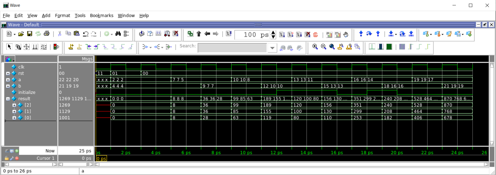

# LAB1: An Array of the Multiply and Accumulate (MAC) module [Design and Simulation]

Deadline: 27th Sep 2021 23:59 EDT

## Getting started
First, clone the git repository onto your home directory on `eceubuntu` lab  server.

```
$ mkdir -p $HOME/ece327-s21/labs
$ cd $HOME/ece327-s21/labs
$ git clone ist-git@git.uwaterloo.ca:ece327-s21/labs/b2luong-lab1.git
$ cd b2luong-lab1
```

## Objective :

The objective of the first lab is to make you comfortable with writing a small amount of Verilog code, use Verilotor to simulate the Verilog, and get familiar with the git submission interface.
Specifically, you will implement an array of the streaming "**Multiply and Accumulate**" module that each module takes two input streams of numbers and generates an output stream of the result. 

* Write Verilog code for a clocked MAC module that computes `result = result + a*b` on a stream of `a` and `b` inputs to generate a stream of `result` output.
* You will be provided with an `initialize` signal that controls when the accumulation restarts. 
* Implement a generic array of the MAC modules. Each module in the array is independent. The whole array receives two sets of 1D inputs of `a` and `b` to generate a 1D `result` output.
* Simulate your MAC module for functional correctness using the provided testbench. Ensure that the generated result matches the expected golden result provided.

## Expected Behavior for MAC module

* The `clk` signal is generated in the testbench and provided to your module. You are expected to operate on the positive edge of the clock. 
* The `rst` signal is asserted initially by the test bench for a single clock cycle. You are expected to reset all registers in your design to `0`.
* The input operands `a` and `b` are supplied in continuous fashion after `rst` is de-asserted. This _continuous_ supply of inputs is called _streaming_ as data is flowing into your hardware block like water in a stream.
* The `initialize` signal behavior is important! When it is asserted, the accumulator should restart the accumulation process. This means the accumulator will discard the accumulated value and start a fresh new accumulation. Take care to ensure you do not lose input data `a` and `b` when `initialize` is asserted.
* The multiplication `a*b` should be accumulated into the `result` register.
* The output `result` is observed after a fixed latency of 1 cycle.

## Expected Behavior for the Array module
* This module implements an array of N independent MAC modules by instantiating those modules using a Verilog `generate` statement.
* The `clk`, `rst`, and `initialize` signals are exactly the same signals that we explained above which will be connected to all MAC modules in the array.
* In the array module instead of 1-element input streams for `a` and `b`, there are N-element array of streams for `a` and `b`. Each MAC module in the array receives a 1-element set of streams for its `a` and `b` inputs.
* There is a 1-element output `result` corresponds to each MAC module. Therefore, the array output is an N-bit `result` signal.

### Expected Waveform: 

The text trace below is the output of $display statements for N=3 and captures the same
information as the waveforms above:

```
# Time=5,a[0]=2,b[0]=4,result[0]=0
# Time=5,a[1]=2,b[1]=4,result[1]=0
# Time=5,a[2]=2,b[2]=4,result[2]=0
# Time=7,a[0]=5,b[0]=4,result[0]=8
# Time=7,a[1]=7,b[1]=4,result[1]=8
# Time=7,a[2]=7,b[2]=4,result[2]=8
# Time=9,a[0]=5,b[0]=7,result[0]=28
# Time=9,a[1]=7,b[1]=7,result[1]=36
# Time=9,a[2]=7,b[2]=9,result[2]=36
# Time=11,a[0]=8,b[0]=7,result[0]=63
# Time=11,a[1]=10,b[1]=7,result[1]=85
# Time=11,a[2]=10,b[2]=9,result[2]=99
# Time=13,a[0]=8,b[0]=10,result[0]=119
# Time=13,a[1]=10,b[1]=10,result[1]=155
# Time=13,a[2]=10,b[2]=12,result[2]=189
# Time=15,a[0]=11,b[0]=10,result[0]=80
# Time=15,a[1]=13,b[1]=10,result[1]=100
# Time=15,a[2]=13,b[2]=12,result[2]=120
# Time=17,a[0]=11,b[0]=13,result[0]=110
# Time=17,a[1]=13,b[1]=13,result[1]=130
# Time=17,a[2]=13,b[2]=15,result[2]=156
# Time=19,a[0]=14,b[0]=13,result[0]=253
# Time=19,a[1]=16,b[1]=13,result[1]=299
# Time=19,a[2]=16,b[2]=15,result[2]=351
# Time=21,a[0]=14,b[0]=16,result[0]=182
# Time=21,a[1]=16,b[1]=16,result[1]=208
# Time=21,a[2]=16,b[2]=18,result[2]=240
# Time=23,a[0]=17,b[0]=16,result[0]=406
# Time=23,a[1]=19,b[1]=16,result[1]=464
# Time=23,a[2]=19,b[2]=18,result[2]=528
# Time=25,a[0]=17,b[0]=19,result[0]=678
# Time=25,a[1]=19,b[1]=19,result[1]=768
# Time=25,a[2]=19,b[2]=21,result[2]=870
```

Modelsim waveform for the same experiment is shown below:



## Creating your design : 

Design an array module in the file `array.sv` to instantiate a 1D grid of MACs
defined in `mac.v`. You will need to use Verilog generate statements to
construct the array of parametric dimensions.  Also, update the file called
`mac.v` already provided in the repository. Only make changes to these two
files. 

The following are the I/O ports of the mac module :

`mac.v`
1. `clk` : 1 bit input : This is the clock input.
2. `rst` : 1 bit input : This is a synchronous active high reset.
3. `a` : D_W bits input : This is the first streaming input.
3. `b` : D_W bits input : This is the second streaming input.
4. `initialize` : 1 bit input : This instructs the accumulator to reset.
5. `result` : D_W_ACC bits output : This is the output of the MAC module. 

The following are the I/O ports of the array module:

`array.sv`
1. `clk` : 1 bit input : This is the clock input.
2. `rst` : 1 bit input : This is a synchronous active high reset. 
3. `a` : D_W bits x N input : a's data lane to feed into array.
3. `b` : D_W bits x N input : b's data lane to feed into array.
4. `initialize` : 1 bit input : This instructs the accumulator to reset.
5. `result` : D_W_ACC bits x N : This is the output of the array module. 

The data width `D_W` is parameterised with a `parameter` declaration on the
Verilog module.  Check the `dut_tb.sv` test bench for an example of how to
declare and use a parameter. We assume that the generated result of the
accumulator is of a larger precision of `D_W_ACC` than the inputs to account for
storage requirements of product and resulting accumulated number.

## Evaluating your design : 

To edit your module within the container, simply type `code mac.v` or `code array.sv`. Visual Studio Code will start in GUI mode (assuming your are the sort of loser you likes GUIs, #yuck).
A more straightforward approach is to use `vi` (`emacs` users, please drop this course now!)

To compile and simulate test your module, simply type `make verilator-test`. The Verilog will be compiled, and simulated. You can view the waveforms with GtkWave, run `gtkwave dut_tb/sim.vcd`. 

To compile and simulate test your module, simply type `make modelsim`. Modelsim
will start in GUI mode.

### Using Xilinx simulator 
If you are facing troubles with Modelsim, you can simulate your design using
Xilinx's toolchain. To use Xilinx simulator type `make xsim` in your terminal.
Vivado will startup in GUI mode.

FYI, we will not grade the Modelsim simulations, but have provided instructions just in case you are curious.

## Submitting your solution

Go to the cloned git repository for lab1.

You can then add in the solution to `mac.v` and `array.sv` and ensure that the test output matches the waveforms shown above.

You can commit your design in two steps:
```
git commit -a -m "solution is ready for grading"
git push origin master
```

You may commit and push as many times are you want prior to submission deadline.

In fact, I would encourage you to frequently commit and check-in your code to the repository so you can track your design progress over time under `Activity` tab on `git.uwaterloo.ca` in the browser.

### Grading Policy

Look at the grade rule in Makefile. This is the script we will use to grade you
and we are giving you this script to self-assess. This will be our policy for
all labs. For Lab 5 there is a small competitive relative ranking component.
- 75% of the lab grade will be reserved for passing `diff golden.txt result.txt` command. A `golden.txt` has been provided to help compute a `diff`. `result.txt` is generated from a Modelsim simulation via our grading script `grade.sh` script. Our scripts will replace other files like `dut_tb.v`, `grade.sh`, etc so do not edit these files. You only need to edit `mac.v` and `array.sv`.
- 25% of the lab grade will be reserved for `verilator -Wall --lint-only array.sv mac.v` generating an empty output. The lint checks help guard against bad coding practices.
- To grade your code, just type `make grade` and `cat grade.csv` to check your
grade score.
- Penalty for late submissions is 50% of the grade. Labs submitted more than three days late will get 0% of the grade.
